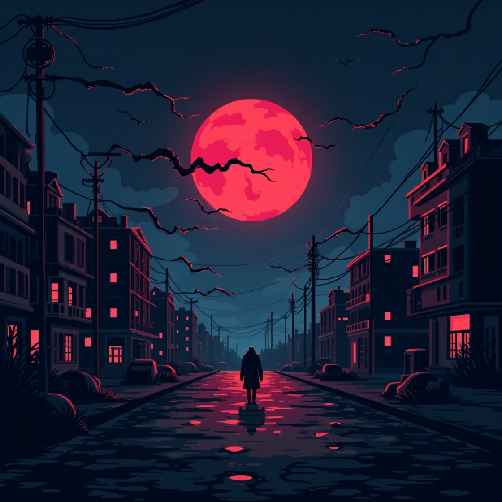

    Ecos do Além: Histórias de Lendas Urbanas 

## :mega: Sobre o Podcast

 Ecos do Além" é o podcast que vai te levar a uma viagem assustadora pelo universo das lendas urbanas. Aqui, exploramos histórias, desde as mais conhecidas até aquelas que poucos ousam contar. 
Nosso objetivo é aguçar sua curiosidade e, quem sabe, provocar aquele friozinho na espinha. Afinal, quem não gosta de um pouco de mistério e misturados com um toque de medo, não é mesmo?
Fique ligado e venha descobrir o que está esperando por você no lado mais sombrio da realidade! <\p>

<a href="./assets/ep_01_a_mulher_do_poço.mp3">:musical_note: EP.01- A MULHER DO POÇO</a>

## 💻 Tecnologias utilizadas no projeto

- [ChatGPT](https://chat.openai.com/) 
- [LeonardoAI](https://leonardo.ai/)
- [ElevenLabs](https://beta.elevenlabs.io/)
- AdobePremiere

## ✨ Como foi feito ?

- Roteiro gerado via chatgpt
- Audio gerado pela elevenLabs
- LeonardoAI Para gerar capas
- Adobe Premiere para tratar aúdio e adicionar sons de fundo

## 📚 Materiais

- [Notion Template](https://www.notion.so/PAS-Podcast-AI-Studio-173425c7613d805696fedc253abfc933)

# Projeto Podcast Gerado por I.A.s

 > ℹ️ **NOTE:** Este é o repositório desenvolvido durante uma live no Youtube em parceria com a [DIO](https://dio.me)

Projeto com o objetivo de gerar um podcast utilizando ferramentas de IA através de prompts mais trabalhado.

Utilizer uma esteira de prompts para gerar cada etapa do processo criativo.

